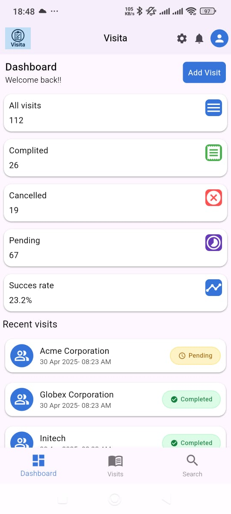
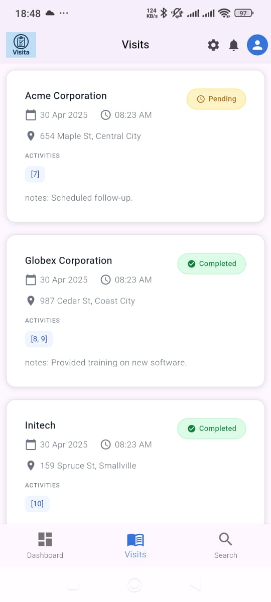
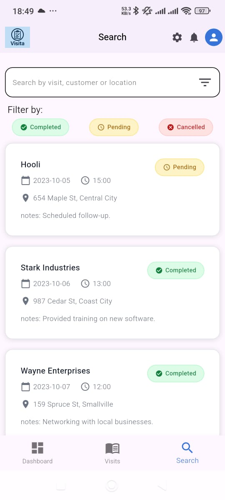
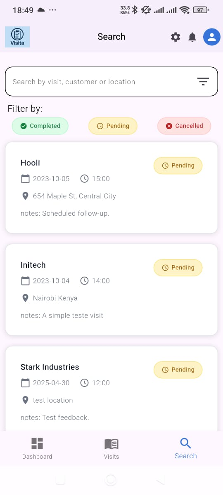
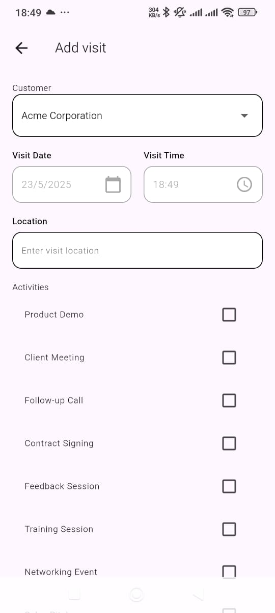

# Visita 🚀

**Visita** is a modern, mobile-first field visit management system built with **Flutter** and **GetX**. It helps organizations manage customer visits, track activities, and analyze performance in real-time all from a clean, intuitive interface.

---

## 🌟 Features

- 🔍 Powerful search & filters (by status, location, customer)
- 📅 Schedule visits with time & date pickers
- ✅ Track visit status: Pending, Completed, Cancelled
- 📍 Log locations and notes per visit
- 📊 Realtime analytics (success rates, visit summaries)
- 📂 Data fetched dynamically from API using GetX & observable state
- 🔐 Designed for scalability and team collaboration

---

## 📸 Screenshots

### 🖼️ Dshboard


### 🖼️ Visit list


### 🖼️ Search Page


### 🖼️ Filters


### 🖼️ Add visit


---

##  Tech Stack

- **Flutter** - Cross-platform UI framework
- **GetX** - State management and routing
- **Dart** - Main programming language
- **REST API** - External service integration
- **Intl** - Date/time formatting

---

## ️ Project Structure
```
lib/
   controllers/     # GetX controllers for logic/state
    constants/      # Reusable UI widgets (e.g. widgest,text, app bar)
    utils/          # Helpers, colors, formatters
    services/      # API service handler
    views/         # UI pages/screens
    main.dart      # App entry point
```


