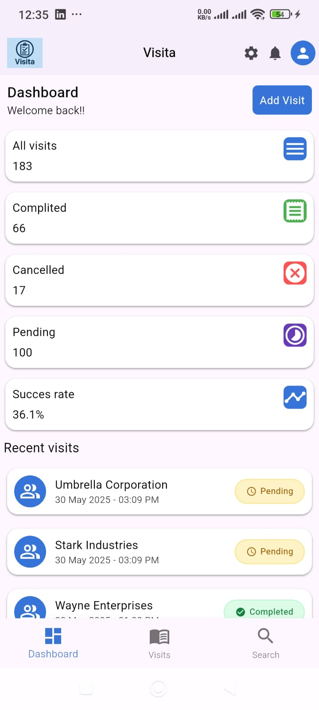
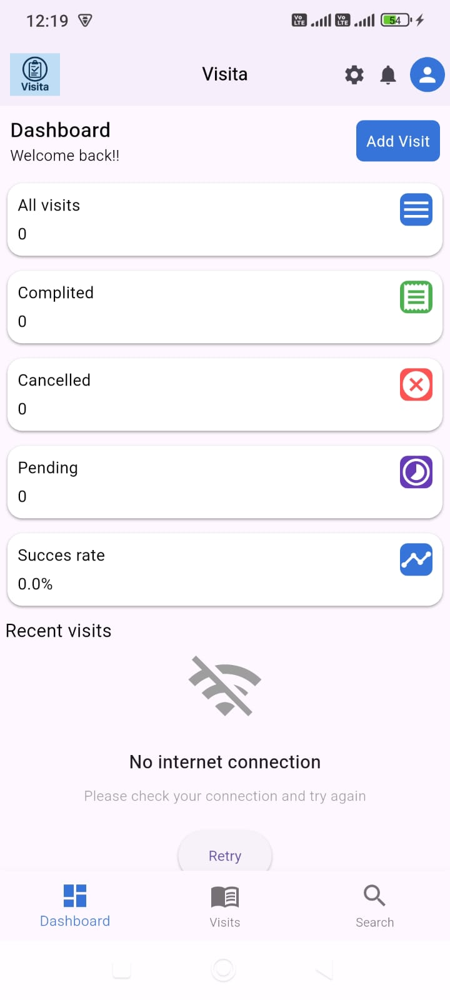
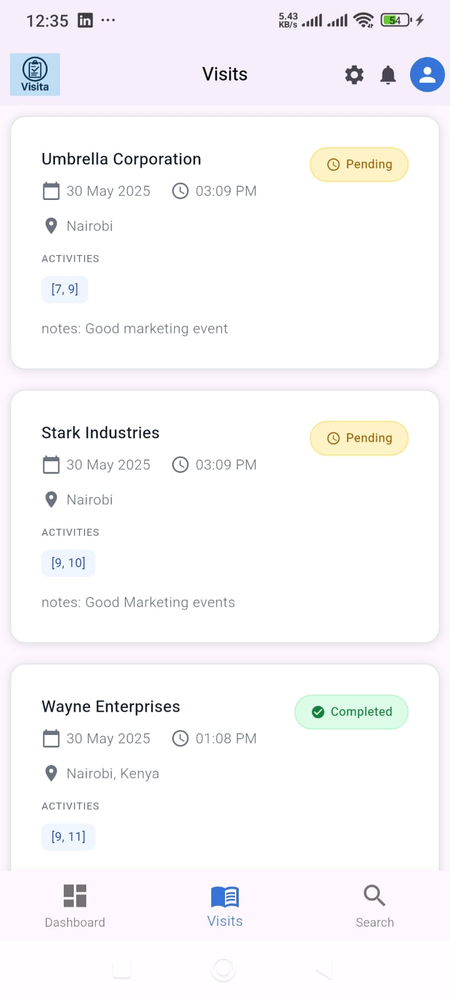
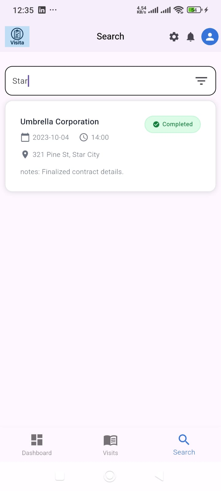

# Visita 🚀

**Visita** is a modern, mobile-first field visit management system built with **Flutter** and **GetX**. It helps organizations manage customer visits, track activities, and analyze performance in real-time all from a clean, intuitive interface.

---

## 🌟 Features

- 🔍 Powerful search & filters (by status, location, customer)
- 📅 Schedule visits with time & date pickers
- ✅ Track visit status: Pending, Completed, Cancelled
- 📍 Log locations and notes per visit
- 📊 Realtime analytics (success rates, visit summaries)
- 📂 Data fetched dynamically from API using GetX & observable state
- 🔐 Designed for scalability and team collaboration
- 🛜 Offline handling,create visit and save locally with the help of hive,
- 🔃 Loading indicators and network stream status,


---

## 📸 Screenshots

### 🖼️ Dashboard


### 🖼️ Network error


### 🖼️ Visit list


### 🖼️ Add visit


### 🖼️ Search Page


### 🖼️ Filters


---

##  Tech Stack

- **Flutter** - Cross-platform UI framework
- **GetX** - Chosen for its simplicity, minimal and powerful combination of:
  - **State Management** – Easily handles UI state reactively with `Obx()` and `Rx` variables.
  - **Dependency Injection** – Controllers can be efficiently injected and reused throughout the app without manual wiring.
  - GetX enabled faster development, better code organization, and improved performance due to its lean and reactive design. It was ideal for building a scalable form-driven app like Visita with minimal friction.
- **Dart** - Main programming language
- **REST API** - External service integration
- **Intl** - Date/time formatting
- **Flutter env** - to hide sensitive data from public
- **Connectivity plus** - To listen to network errors
---

## ️ Project Structure
```
lib/
   controllers/     # GetX controllers for logic/state
    constants/      # Reusable UI widgets (e.g. widgest,text, app bar)
    utils/          # Helpers, colors, formatters
    services/      # API service handler
    views/         # UI pages/screens
    main.dart      # App entry point
```
## ⚙️ Setup Instructions

### Prerequisites

- Flutter SDK installed (`flutter doctor`)
- Git and IDE (VSCode or Android Studio)
- A REST API backend (ensure `/visits`, `/customers`, `/activities` endpoints are available)

### Getting Started

```bash
git clone https://github.com/Dev-Kibiwot/visita
cd visita
flutter pub get
flutter run
```
###  Offline Support
Currently Implemented which include local data caching using `hive` to allow:
- Offline access to visit records
- Background sync on reconnect

### Testing
- Plans to introduce:
  - Unit tests for GetX controllers
  - Widget tests for UI validation
  - 
 ### Continuous Integration (CI/CD)
CI/CD is configured using GitHub Actions and runs automatically on each push or pull request to the main branch.

#### ✅ Workflow Includes:
- Static Analysis & Testing
- Checks out code
- Sets up Java and Flutter environments
- Runs:
- flutter pub get (fetch dependencies)
- flutter analyze (lint and code quality)
- flutter test (run unit/widget tests)

#### Build for Android
- Triggered only after successful test job
- Builds a release APK using
- After building the APK, the workflow
- Installs the Firebase CLI
- Authenticates using a secure service account
- Uploads the release build to Firebase App Distribution, making it instantly available    to testers or teams.
 #### 🔐 Firebase Integration
- Uses GitHub Secrets for secure service account credentials

- Automatically distributes the build to a tester group ie testers

- Includes release notes and supports future staged rollouts 

#### Limitation
- Doesn't create new visit due permission but configured to create both when online and offline.
 
